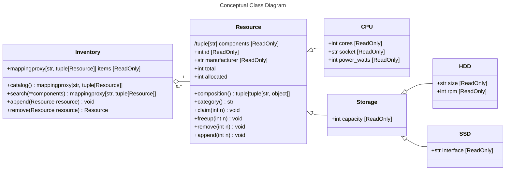

# Description
Class hierarchy to represent items in an inventory.

Project 3 from Python3 Deep Dive Part 4.
Inheritance kinda sucks. It produces hard-to-maintain code with hard-to-reason-about dependencies.

Project specification at [python-deepdive](https://github.com/fbaptiste/python-deepdive).

